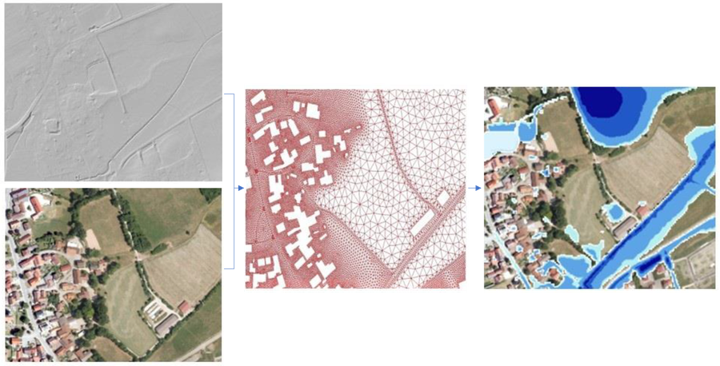
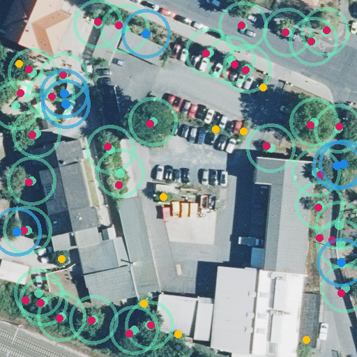
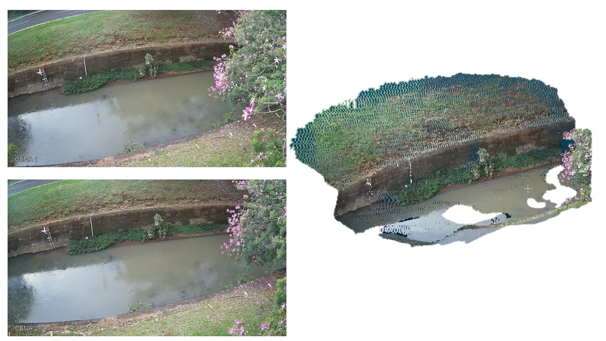
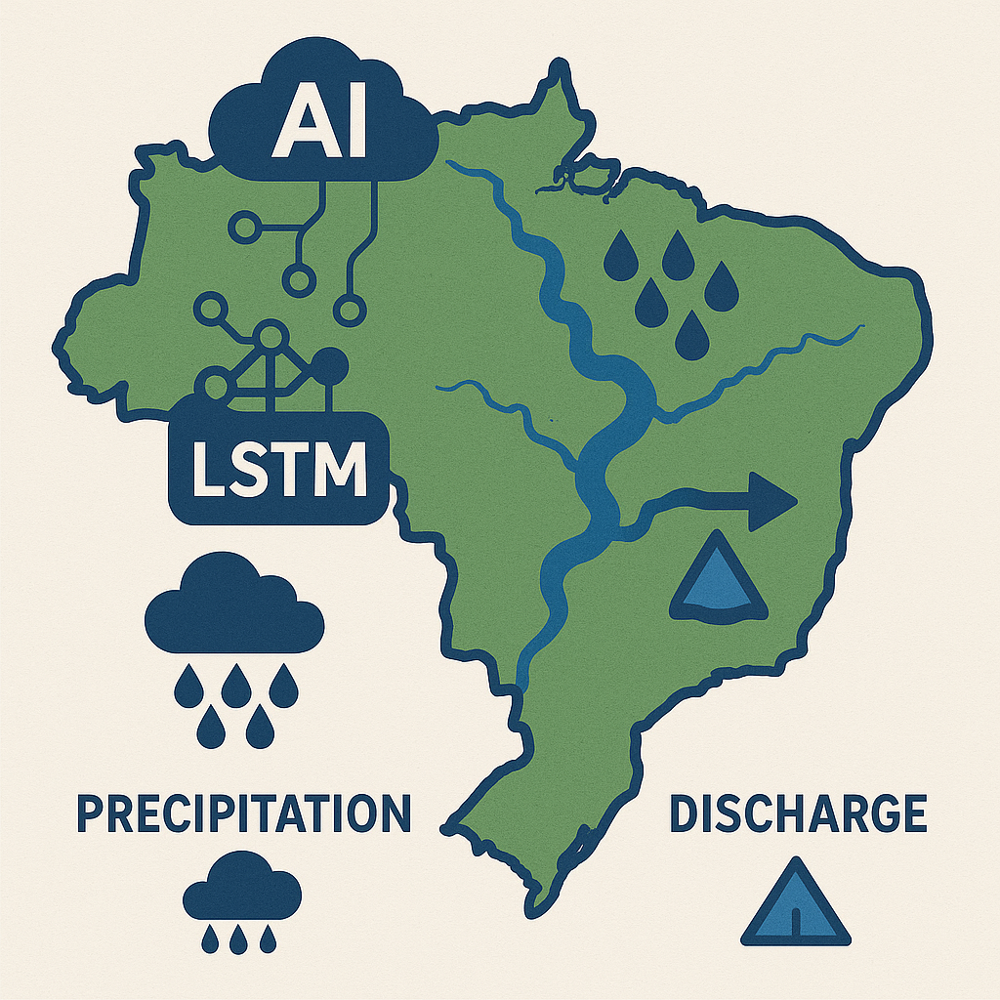
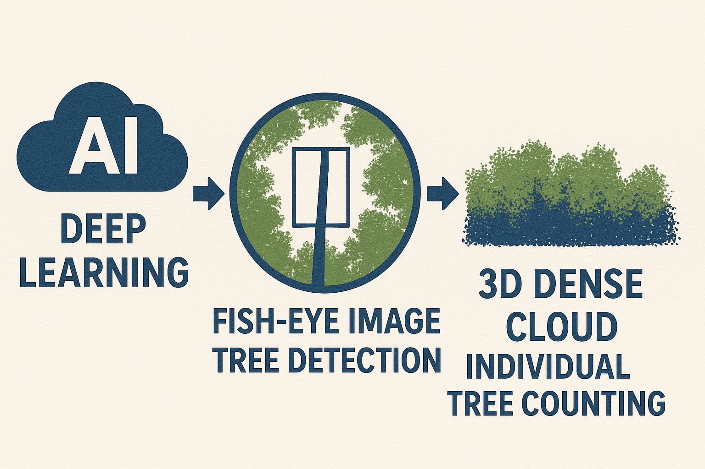

I am an Environmental Engineer with a strong academic background, including a Master's and Ph.D. in Water Resources and Sanitation. I worked for 5 years in the HEroS (Hydrology, Erosion and Sediments) Research and Laboratory Group, focused on water and soil conservation studies. I gained extensive experience in fieldwork, rainfall simulation for soil loss and infiltration studies, assessment of water and soil conservation systems, and hydro-sedimentological monitoring.

During my Ph.D., I applied Machine Learning and Deep Learning techniques to address complex environmental problems, combining technological innovation with sustainable environmental management. I bring a skill set that integrates research, advanced data analysis, and field practices, contributing to developing effective, evidence-based solutions for environmental challenges.

I currently work as a researcher at the Geosensor Systems group at the Dreden University of Technology (Germany). I have a strong interest in developing methods combining photogrammetry with deep learning to advance low-cost monitoring systems. Also, in the use of deep learning for prediction of environmental systems.

## From the Terminal
I’m starting something a little different—my very own monthly newsletter. This will be a space where I share thoughts, behind-the-scenes glimpses of what I’m working on, bits of inspiration, and whatever else I find meaningful.

Whether it’s research, creative projects, or just experiments in progress, I want this to be an honest, evolving log of what I’m building and learning along the way.

Thanks for being here at the start. Let’s see where this goes.

## Publications
Full list of publications can be seen at my [Google Scholar](https://scholar.google.com/citations?user=ceCzploAAAAJ&hl=de). 

**Main publications**

[Zamboni, P., Blumlein, M., Lenz, J., Gonçalves, W. N., Junior, J. M.,  Wöhling, T., Eltner, A. Measuring water ponding time, location and connectivity on soil surfaces using time-lapse images and deep learning.  Catena, 254, 2025. https://doi.org/10.1016/j.catena.2025.108919](https://doi.org/10.1016/j.catena.2025.108919)

[Zamboni, P., Gorriz, X. B., Junior, J. M., Goncalves, X. N., Eltner, A. Do we need to label large datasets for river water segmentation? Benchmark and stage estimation with minimum to non-labeled image time series. 2024. International Journal of Remote Sensing, 1–29. https://doi.org/10.1080/01431161.2025.2457131]( https://doi.org/10.1080/01431161.2025.2457131)

[Zamboni, P., Junior, J.M., Silva, J.D.A., Miyoshi, G.T., Matsubara, E.T., Nogueira, K.; GonCAlves, W.N. Benchmarking Anchor-Based and Anchor-Free State-of-the-Art Deep Learning Methods for In- dividual Tree Detection in RGB High-Resolution Images. Remote Sens. 2021, 13, 2482](https://www.mdpi.com/2072-4292/13/13/2482)

## On going project

This project aims to merge both DEM types with a robust method for aligning point clouds and automated integration of UAV-recognized structures, enhancing accuracy and coverage for runoff simulations to provide municipalities with up-to-date, informative heavy rain risk maps.
[Project link](https://tu-dresden.de/bu/umwelt/geo/ipf/geosensorsysteme/forschung/forschungsprojekte/uav-srgk-entwicklung-eines-verfahrens-zur-automatisierten-fusion-und-klassifikation-von-als-und-uav-daten-zur-erstellung-von-starkre-gengefahrenkarten?set_language=en)
 

### Deep Learning-Driven Mapping of Individual Urban Trees with High-Resolution Multimodal Data

This project focuses on mapping individual trees in urban environments using deep learning and high-resolution multimodal data, such as aerial imagery, LiDAR, and multispectral inputs. By leveraging AI, the system can accurately detect, classify, and localize trees at the individual level, supporting urban planning, green space monitoring, and environmental analysis with high spatial precision.
 

<h3 align="right"> AI and Stereo Photogrammetry for Low-Cost River Digital Twin Generation</h3>

Traditional water level monitoring with sensors can fail during floods or droughts. Camera gauges are a safer, low-cost alternative, but current methods often depend on complex 3D models and extra ground data.
This research proposes using a stereo camera setup to directly create 3D river cross-sections from image pairs, eliminating the need for pre-existing models. The key innovation is combining AI with stereo-photogrammetry—first to improve the image matching process, and eventually to handle the entire 3D reconstruction from raw images. The goal is to build a fully AI-driven system that creates accurate, real-time digital twins of rivers, making water monitoring more robust, scalable, and low-maintenance.
 

### Deep learning for river water velocity and discharge estimation 

Estimating river water velocity is key for understanding flow dynamics and calculating discharge. Traditional methods like Particle Image Velocimetry (PIV) require careful tuning of many parameters and often struggle under challenging conditions, such as poor lighting, low contrast, or surface disturbances. AI offers a powerful alternative by learning patterns directly from image sequences, reducing the need for manual adjustments. It can adapt better to varying environmental conditions and consistently deliver accurate velocity estimates. By using AI to estimate surface velocity, we can more reliably and efficiently calculate river discharge, improving the accuracy and automation of hydrological monitoring. 
Pellentesque nibh. Aenean quam. In scelerisque sem at dolor. Maecenas mattis.

 

<h3 align="right">Leveraging AI and 3D Photogrammetry for Flower Mapping, Counting, and Trait Estimation from UAV Imagery </h3>

This project combines AI and UAV imagery to detect and analyze flowers in trees at two scales. At the landscape level, AI models process aerial images to map flower distribution across large areas. At the individual tree level, high-resolution UAV images are used to detect flowers, reconstruct their positions in 3D, and estimate their size and count. The goal is to create a scalable, precise system for floral monitoring using AI-driven detection and 3D photogrammetric analysis.

 

<h3 align="right">LSTM4Flow-BR: Training Strategies for Multi-Scale Discharge Estimation </h3>

This project focuses on developing and evaluating training strategies for applying LSTM models to river discharge estimation at different spatial and temporal scales across Brazil. It emphasizes student learning and capacity building, combining hands-on experience with deep learning techniques and hydrological modeling. The goal is to explore how scalable LSTM approaches can improve discharge predictions in diverse Brazilian river basins while fostering the next generation of researchers in environmental A

 

###  Counting Eucalyptus Trees with AI and Fisheye Photogrammetry

This project explores the use of low-cost fisheye cameras combined with AI and photogrammetry to detect and count individual eucalyptus trees. Fisheye images offer a major advantage with their wide field of view, allowing large portions of the canopy to be captured in a single frame—ideal for forest monitoring. However, the heavy lens distortion poses challenges for standard deep learning object detection methods, which must be carefully evaluated and adapted for this image type. The project focuses on training and assessing deep learning models for accurate tree detection in fisheye imagery. Detected tree regions are then integrated into the photogrammetric process to guide dense point cloud generation, filtering out irrelevant background and isolating only tree structures. This targeted approach enables accurate 3D reconstruction and counting of individual trees, offering an efficient and affordable method for forest inventory and monitoring.
 

<h3 align="right"> Automated fusion and classification of ALS and UAV data for the creation of heavy rain hazard maps  </h3>

## Teaching
- Object detection and geodata fusion - Master in Geoinformatics (TU Dresden)-
  - Pyhthon, point cloud processing, and deep learning for computer vision  

## Education
- PhD, Environmental technology | Federal University of Mato Grosso do Sul  (_2024_)	 						       		
- M.S., Environmental technology | Federal University of Mato Grosso do Sul  (_2019_)	 		 			        		
- B.S., Environmental Engineering | Federal University of Mato Grosso do Sul  (_2017_)

  
## Contact
Email : pedro.zamboni@tu-dresden.de

Linkedin : [https://www.linkedin.com/in/pedro-zamboni/](https://www.linkedin.com/in/pedro-zamboni/)
